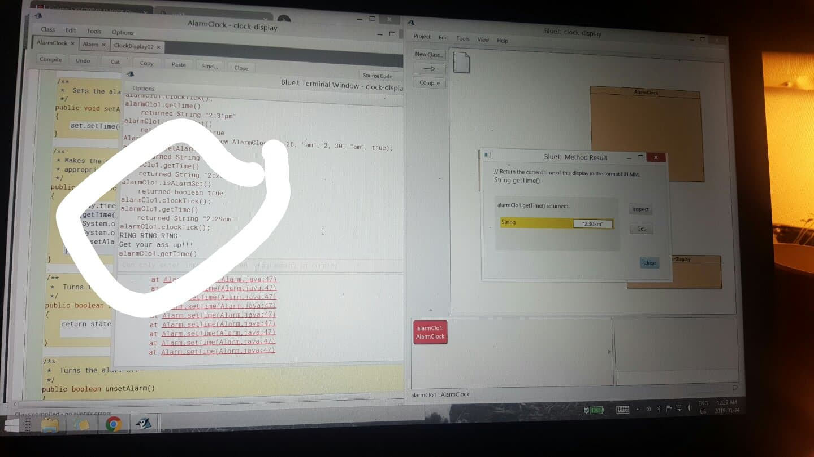

# Java-Alarm-Clock
This is a alarm clock that was built by using BlueJ's IDE in java. 

Note that some of the code was written by
 * @author Michael Kölling and David J. Barnes
 * @version 2011.07.31
 
Sample image of the clock

